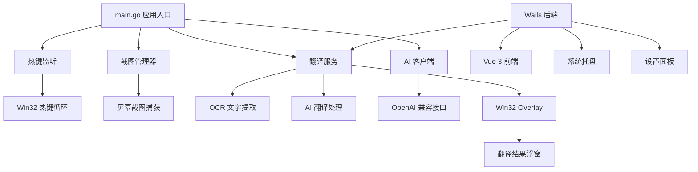

# Translater 桌面翻译助手

[](https://golang.org)
[](https://vuejs.org)
[](https://wails.io)
[](LICENSE)

Translater 是一个专为 Windows 平台设计的智能截图翻译工具，通过快捷键即可触发截图区域选择，自动完成 OCR 文字识别、AI 翻译，并在原位置显示半透明浮窗展示翻译结果。

> ⚠️ **重要声明**：本项目仅供学习和个人使用，严禁任何商业化行为。如需在源代码基础上修改发布，必须保留原作者标识与本声明。

## ✨ 核心特性

### 🚀 一键翻译体验
- **快捷键触发**：默认 `Alt+T` 快速启动截图选择
- **智能 OCR**：自动识别截图区域中的文字内容
- **即时翻译**：后台调用 AI 模型完成高质量翻译
- **浮窗展示**：在截图位置显示半透明翻译结果浮窗

### 🎨 优秀的用户体验
- **自适应界面**：翻译浮窗自动调整字体大小和布局
- **暗色主题**：支持半透明暗色背景，不干扰视觉
- **自动复制**：翻译结果可自动复制到剪贴板
- **置顶选项**：支持翻译窗口置顶显示
- **完成提醒**：可选的 Toast 通知提醒

### 🔧 高度可定制
- **自定义提示词**：支持文字提取和翻译阶段的独立提示词配置
- **多模型支持**：翻译和视觉模型可分别配置
- **多服务商兼容**：支持任何 OpenAI Chat Completions 协议的 API
- **语言配置**：支持多种源语言和目标语言组合
- **流式输出**：支持实时显示翻译进度

### 🖥️ 现代化界面
- **Wails 桌面应用**：基于 Wails 框架的原生 Windows 应用
- **Vue 3 前端**：使用 Vue 3 + TypeScript 构建的现代化设置界面
- **系统托盘**：最小化到系统托盘，方便随时调用
- **设置持久化**：配置自动保存到用户目录

## 🏗️ 系统架构



### 核心模块说明

| 模块 | 路径 | 功能描述 |
|------|------|----------|
| **应用入口** | [`main.go`](main.go:1) | 启动热键循环，初始化所有核心服务 |
| **AI 客户端** | [`core/ai/`](core/ai/ai.go:1) | OpenAI 兼容客户端，支持翻译和视觉模型 |
| **提示词管理** | [`core/prompts/`](core/prompts/prompts.go:1) | 默认和自定义提示词管理，支持动态变量替换 |
| **截图服务** | [`core/screenshot/`](core/screenshot/screenshot.go:1) | 基于第三方库的屏幕截图功能 |
| **翻译服务** | [`core/translation/`](core/translation/service.go:1) | 串联截图→OCR→翻译的完整流程 |
| **热键处理** | [`core/hotkey/`](core/hotkey/hotkey.go:1) | Win32 系统级热键注册和监听 |
| **浮窗 UI** | [`core/ui/overlay/`](core/ui/overlay/overlay.go:1) | Win32 原生翻译结果浮窗 |
| **桌面应用** | [`frontend/app.go`](frontend/app.go:1) | Wails 后端服务，与前端通信 |
| **前端界面** | [`frontend/frontend/`](frontend/frontend/src/App.vue:1) | Vue 3 + TypeScript 设置界面 |

## 🔄 工作流程

1. **启动阶段**：程序注册系统热键 `Alt+T`，初始化 AI 客户端和翻译服务
2. **截图触发**：用户按下热键，启动截图选择界面
3. **文字提取**：调用视觉模型进行 OCR，提取图片中的文字内容
4. **AI 翻译**：根据配置的提示词和模型，将提取的文字翻译为目标语言
5. **结果展示**：在原截图位置显示翻译结果浮窗，同时复制到剪贴板
6. **配置管理**：通过 Wails 桌面应用管理用户设置和配置

## 📋 环境要求

### 系统要求
- **操作系统**：Windows 10 或更高版本（依赖 Win32 API）
- **运行时**：Windows WebView2 Runtime（Win11 自带，Win10 需安装）

### 开发环境
- **Go**：1.24+ 
- **Node.js**：18+ 
- **npm**：最新版本
- **Wails CLI**：`go install github.com/wailsapp/wails/v2/cmd/wails@latest`

### API 服务
- **API Key**：兼容 OpenAI Chat Completions 协议的 API Key
- **推荐服务**：[智谱开放平台](https://open.bigmodel.cn/) 或其他兼容服务商

## 🚀 快速开始

### 1. 克隆项目
```bash
git clone <repository-url>
cd Translater
```

### 2. 安装依赖
```bash
# 安装 Go 依赖
go mod download

# 安装前端依赖
cd frontend/frontend
npm install
cd ../../
```

### 3. 配置 API Key

#### 方法一：环境变量文件
在项目根目录创建 `.env` 文件：
```env
API-KEY=sk-your-api-key-here
```

#### 方法二：应用内配置
1. 运行应用后，右击系统托盘图标
2. 打开设置面板
3. 在「API 配置」中输入密钥
4. 配置会自动保存到 `%AppData%/Translater/settings.json`

### 4. 运行应用

#### 开发模式 - CLI 版本
```bash
go run .
```

#### 开发模式 - 桌面版本
```bash
cd frontend
wails dev
```

#### 生产构建
```bash
cd frontend
wails build -clean
```

### 5. 使用翻译功能
1. 按 `Alt+T` 启动截图选择
2. 拖拽选择要翻译的屏幕区域
3. 等待 AI 处理，查看翻译结果浮窗
4. 结果已自动复制到剪贴板

## ⚙️ 配置说明

### API 配置
- **翻译 API Key**：用于文本翻译的 API 密钥
- **视觉 API Key**：用于 OCR 的 API 密钥（可选，默认使用翻译密钥）
- **Base URL**：API 服务地址，支持自定义网关
- **模型选择**：翻译模型和视觉模型可独立配置

### 提示词配置
- **文字提取提示词**：控制 OCR 阶段的文字识别行为
- **翻译提示词**：控制翻译阶段的输出质量和格式
- **动态变量**：支持 `{{.SourceLanguage}}`、`{{.TargetLanguage}}` 等占位符

### 行为配置
- **自动复制**：翻译完成后自动复制到剪贴板
- **窗口置顶**：翻译结果浮窗置顶显示
- **完成提醒**：翻译完成后显示 Toast 通知
- **快捷键**：自定义热键组合
- **流式输出**：实时显示翻译进度

### 语言配置
支持的语言包括：
- **中文**：简体中文 (zh-CN)、繁体中文 (zh-TW)
- **亚洲语言**：日文 (ja)、韩文 (ko)、泰文 (th)、越南文 (vi)
- **欧洲语言**：英文 (en)、法文 (fr)、德文 (de)、西班牙文 (es)、意大利文 (it)、俄文 (ru)
- **其他**：阿拉伯文 (ar)、葡萄牙文 (pt)

## 📁 配置存储

用户配置文件位置：`%AppData%/Translater/settings.json`

主要配置字段：
```json
{
  "apiKeyOverride": "用户设置的翻译 API Key",
  "visionApiKeyOverride": "用户设置的视觉 API Key", 
  "apiBaseUrl": "翻译 API 地址",
  "visionApiBaseUrl": "视觉 API 地址",
  "translateModel": "翻译模型名称",
  "visionModel": "视觉模型名称",
  "extractPrompt": "自定义文字提取提示词",
  "translatePrompt": "自定义翻译提示词",
  "autoCopy": true,
  "windowOnTop": false,
  "showNotification": true,
  "hotkeyModifiers": ["Alt"],
  "hotkeyKey": "T",
  "sourceLanguage": "auto",
  "targetLanguage": "zh-CN"
}
```

> 💡 **提示**：删除配置文件可恢复所有默认设置

## 🛠️ 开发指南

### 代码规范
```bash
# 格式化代码
go fmt ./...

# 静态检查
go vet ./...

# 运行测试
go test ./... -v

# 构建检查
go build ./...
```

### 项目结构
```
Translater/
├── main.go                 # 应用入口点
├── core/                   # 核心业务逻辑
│   ├── ai/                # AI 客户端和接口
│   ├── config/            # 配置管理
│   ├── hotkey/            # 系统热键处理
│   ├── prompts/           # 提示词管理
│   ├── screenshot/        # 截图功能
│   ├── translation/       # 翻译服务
│   └── ui/overlay/        # 原生浮窗 UI
├── frontend/              # Wails 桌面应用
│   ├── app.go            # Wails 后端
│   ├── wails.json        # Wails 配置
│   └── frontend/         # Vue 3 前端
│       ├── src/          # 源代码
│       ├── package.json  # 前端依赖
│       └── vite.config.ts # 构建配置
└── third_party/          # 第三方代码
```

### 测试策略
- **单元测试**：使用 Go 标准测试框架
- **Mock 测试**：模拟 AI 客户端，避免网络调用
- **集成测试**：测试完整的翻译流程
- **Windows 测试**：标记 Windows 特定功能的测试

## 🔧 故障排除

| 问题现象 | 可能原因 | 解决方案 |
|---------|---------|---------|
| 启动提示找不到 API Key | `.env` 文件缺失或格式错误 | 检查 `.env` 文件格式，或在设置面板中配置 |
| 热键无法触发 | 热键被其他程序占用 | 在设置面板中修改热键组合 |
| 截图后无响应 | WebView2 运行时缺失 | 安装 Windows WebView2 Runtime |
| 翻译结果为空 | API 配置错误或网络问题 | 检查 API Key、Base URL 和网络连接 |
| 浮窗不显示 | 被安全软件拦截 | 将程序添加到杀毒软件白名单 |
| 构建失败 | 依赖版本冲突 | 清理模块缓存：`go clean -modcache` |

## 📦 构建与发布

### 开发构建
```bash
# 前端开发模式
cd frontend
wails dev

# 后端开发模式
go run .
```

### 生产构建
```bash
# 基础构建
cd frontend
wails build -clean

# 生成安装包（需要 NSIS）
wails build -clean -nsis

# 压缩可执行文件（需要 UPX）
wails build -clean -upx
```

构建产物位置：`frontend/build/bin/`

## 🚀 自动发布

项目配置了 GitHub Actions 自动发布流程，当您创建版本标签时会自动构建和发布。

### 发布流程
1. **创建版本标签**：
   ```bash
   git tag v1.0.0
   git push origin v1.0.0
   ```
2. **自动构建**：GitHub Actions 自动触发构建流程
3. **发布完成**：自动在 GitHub 创建 Release，包含：
   - `Translater-Setup.exe`：安装版程序
   - `Translater-v1.0.0-windows-portable.zip`：便携版程序

### 工作流配置
- **发布配置**：[`.github/workflows/release.yml`](.github/workflows/release.yml) - 自动发布工作流

## 🤝 贡献指南

1. **Fork 项目**并创建功能分支
2. **遵循代码规范**：运行 `go fmt ./...` 和前端 lint
3. **编写测试**：确保新功能有对应的测试覆盖
4. **更新文档**：如有必要，更新相关文档
5. **提交 PR**：使用 Conventional Commits 格式

### 提交信息规范
```
<type>[optional scope]: <description>

[optional body]

[optional footer(s)]
```

类型说明：
- `feat`: 新功能
- `fix`: 修复 bug  
- `docs`: 文档更新
- `style`: 代码格式调整
- `refactor`: 代码重构
- `test`: 测试相关
- `chore`: 构建过程或辅助工具的变动

## 📄 许可证

本项目采用非商业许可证，仅供学习和个人使用。如需商业使用，请联系原作者。

## 🙏 致谢

- **原作者**：HandyWote
- **核心技术栈**：Go、Vue 3、Wails、TypeScript
- **第三方库**：详见 [`go.mod`](go.mod:1) 和 [`package.json`](frontend/frontend/package.json:1)

## 📞 联系方式

如有问题或建议，请通过以下方式联系：
- 邮箱：handy@handywote.top
- GitHub Issues：在项目仓库中提交 Issue

---

⭐ 如果这个项目对您有帮助，请给个 Star 支持一下！
